# :sunglasses:Scala Basics01

## 01-:rocket:scala简介：

:sunglasses:

### 1-:baby:是什么？

1. 是运行在JVM上
   1. 使用Scalac编译源码生成.class文件运行在JVM上
2. 多范式编程语言
   1. 多种编程思想的结合
3. 支持面向对象以及面向函数式编程思想
   1. 函数也是一个对象

### 2-:baby:为什么？

1. Spark是Scala开发的
2. 表达能力强
3. 与Java的无缝对接
4. 可以更好的控制程序的复杂程度，保证开发效率

## 02-:rocket:Scala解释器:

```  Scala
开启：
win + r  scala

测试：
println("hello world")

退出：
:quit
```

## 03-:rocket:变量:

### 1​-:baby:声明变量：

```scala
Java: 	int num = 5
Scala: 	val/car num :Int = 5
```

### 2-:baby:语法格式：

```scala
val/var 变量标识符 : 变量类型 = 初始值

val 定义的为不可以重新赋值的变量
var 定义的为可以重新赋值的变量
```

#### :angel:截图：

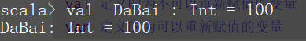

### 3-:baby:惰性赋值：

- 当变量数据过大时直接加载到JVM内存开销很大

#### 解决办法:(惰性赋值)：

格式：

```scala
lazy val/var 变量名 = 表达式
```

### 4-:baby:注意：

1. Scala中定义变量类型写在变量名后面
2. Scala的语句最后不需要 添加分号
3. 优先使用val 定义变量，如需重新赋值才用var
4. Scala可以自动根据变量值来推断变量类型

## 04-:rocket:字符串:

### 1-:baby:使用双引号：

#### 1-:baby_bottle:语法格式：

```scala
val/var 变量名 = “字符串”
```

#### 2-:baby_bottle:问题：如一个人叫 "DaBai" 打印出他的名字及长度？

#### 代码实现：

```scala
println (name + "-----" + name.lengh) 
```

#### 3-:baby_bottle:代码截图：

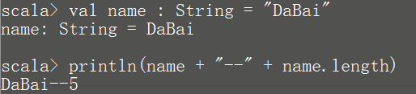

### 2-:baby:使用插值表达式:

#### :baby_bottle:格式:

```Scala
val/var 变量名 = s"${变量/表达式}字符串"

****使用关键字s""来定义插值表达式
****在双引号内使用$来运用变量
****使用{}来区分变量二号普通字符
```

#### :baby_bottle:举例：

```properties
请定义若干个变量，分别保存："zhangsan"、30、"male"，定义一个字符串，保存这些信息。

打印输出：name=zhangsan, age=30, sex=male
```

#### :baby_bottle:参考代码：

```scala
scala> val name = "DaBai"                                    name: String = DaBai                                                                                                  scala> val age = 18                                         age: Int = 18                                                                                                           scala> val sex = "king"                                     sex: String = king                                                                                                       scala> val info = s"name=${name},age=${age},sex=${sex}"     info: String = name=DaBai,age=18,sex=king                                                                               scala> println(info)                                         name=DaBai,age=18,sex=king 
```

#### :baby_bottle:代码截图：

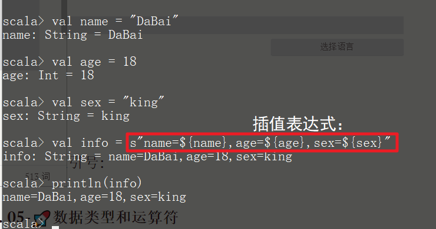

### 3-:baby:三引号：

#### :baby_bottle:格式：

```scala
val/var 变量名 = """字符串1  字符串2  """
```

#### :baby_bottle:举例：

```properties
打印此SQL语句：
    select
            *
     from
          t_user
     where
          name = "DaBai"
```

#### :baby_bottle:参考代码:

```scala
val sql = """select
     | *
     | from
     |     t_user
     | where
     |     name = "dabai""""

println(sql)
```

#### :baby_bottle:注意:

- 但是要注意一点, 三引号字符串不要出现重复, 比如 ""'' aaa """ bbb """

#### :baby_bottle:原因：

- 因为, scala编译器, 从第一个三引号开始, 到第二个三引号结束, 算一个完整的字符串. 后面的就是多出来的语法错误的内容

#### :baby_bottle:代码截图:

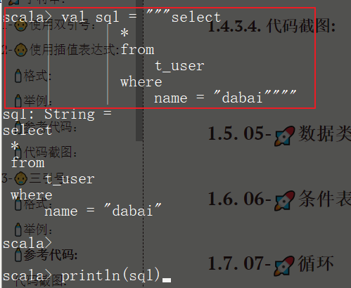

## 05-:rocket:数据类型和运算符

### 1-:baby:数据类型:

| 基础类型 | 类型说明                 |
| -------- | ------------------------ |
| Byte     | 8位带符号整数            |
| Short    | 16位带符号整数           |
| **Int**  | 32位带符号整数           |
| Long     | 64位带符号整数           |
| Char     | 16位无符号Unicode字符    |
| String   | Char类型的序列（字符串） |
| Float    | 32位单精度浮点数         |
| Double   | 64位双精度浮点数         |
| Boolean  | true或false              |

#### :baby_bottle:scala类型与Java的区别:

````properties
1. scala中所有的类型都使用**大写字母**开头
2. 整形使用`Int`而不是Integer
3. scala中定义变量可以不写类型，让scala编译器自动推断
````

### 2-:baby:运算符：

| 类别       | 操作符                        |
| ---------- | ----------------------------- |
| 算术运算符 | +、-、*、/、%(加减乘除和取模) |
| 关系运算符 | >、<、==、!=、>=、<=          |
| 逻辑运算符 | &&、&#124;&#124;、!           |
| 位运算符   | &、&#124;&#124;、^、<<、>>    |

#### :baby_bottle:注意:

**Scala 中的运算符, 基本上和Java一样, 除了以下：**

```properties
1. Scala 没有++ 或者 --
2. == 相当于 equals 用来比较我们的对象的值是否相等
3. eq 方法用来比较内存地址值:
	也就是如果想要判断两个对象的值是否相等的时候, 推荐使用==方法, 因为如果比较对象为null的时候,用equals会报错的,而==会帮我们进行判断
4.Scala中的类型均是大写开头
```

#### :baby_bottle:举例：

```properties
有一个字符串"abc"，再创建第二个字符串，值为：在第一个字符串后拼接一个空字符串。

然后使用比较这两个字符串是否相等、再查看它们的引用值是否相等。
```

#### :baby_bottle:代码实现：

```
scala> val dabai = "dabai"                                   dabai: String = dabai                                                                                                   scala> val xiaobai = dabai + ""                             xiaobai: String = dabai                                                                                                 scala> dabai == xiaobai                                     res0: Boolean = true                                                                                                     scala> dabai.eq(xiaobai)                                     res1: Boolean = false  
```

#### :baby_bottle:代码截图：

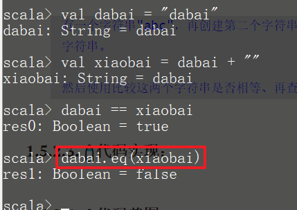

### 3-:baby:scala类型层次结构:


#### :baby_bottle:注意：

**所有的类型都是从Any继承了, 也就是我们Scala是一种单根继承体系**

| 类型    | 说明                                                         |
| ------- | ------------------------------------------------------------ |
| Any     | **所有类型**的父类，,它有两个子类AnyRef与AnyVal              |
| AnyVal  | **所有数值类型**的父类                                       |
| AnyRef  | 所有对象类型（引用类型）的父类 (String 本质就是Char数组, 也是引用类型哦) |
| Unit    | 表示空，Unit是AnyVal的子类，它只有一个的实例() <br />它类似于Java中的void，但scala要比Java更加面向对象, Unit 本身也是一个类哦, 当返回值为空的时候,返回的就是Unit, Unit的实例就是一个括号() |
| Null    | Null也就是AnyRef的子类，也就是说它是所有引用类型的子类。它的实例是**null**<br />可以将null赋值给任何引用对象类型 |
| Nothing | 所有类型的**子类**<br />不能直接创建该类型实例，某个方法抛出异常时，返回的就是Nothing类型，因为Nothing是所有类的子类，那么它可以赋值为任何类型 |

#### :baby_bottle:举例一:(nothing)

```scala
def main(args: Array[String]): Unit = {
    val c = m3(1,0)
}

def m3(x:Int, y:Int):Int = {
    if(y == 0) throw new Exception("这是一个异常")
    x / y
}
```

#### :baby_bottle:代码截图:

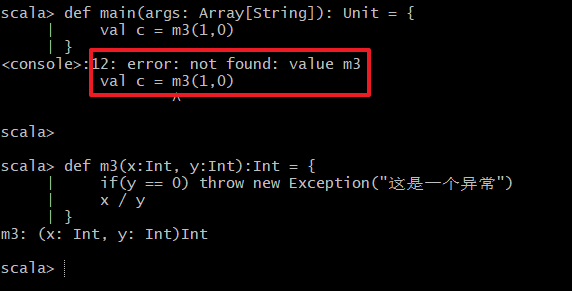

#### :baby_bottle:举例二:

**以下代码是否有问题**

```scala
val b:Int = null
```

#### :baby_bottle:代码截图:

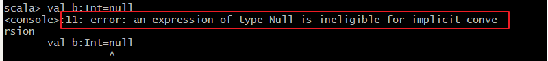

#### :baby_bottle:原因:

```properties
scala会解释报错：

Null类型并不能转换为Int类型，说明**Null类型并不是Int类型的子类**, 也就是不是数值类型AnyVal的子类
```

## 06-:rocket:条件表达式:

### 1-:baby:简介：

**条件表达式就是if表达式，if表达式可以根据给定的条件是否满足，根据条件的结果（真或假）决定执行对应的操作。scala条件表达式的语法和Java一样。**

### 2-:baby:有返回值的if表达式：

与Java的区别：

1. **在scala中，条件表达式也是有返回值的**
2. **在scala中，没有三元表达式，可以使用if表达式替代三元表达式**

#### :baby_bottle:格式：

```scala
if (变量名>0) {"正整数"} else {"负数"}

如果 {}中只有一个表达式 {} 可以省略, 如下：
val a = if(变量名>0) 1 else 0
```

#### :baby_bottle:举例：

```properties
定义一个变量sex，再定义一个result变量，如果sex等于"king"，result等于1，否则result等于0
```

#### :baby_bottle:参考代码：

```scala
scala> val sex = "king"
sex: String = king

scala> val result = if(sex == "king") 1 else 0
result: Int = 1

```

#### :baby_bottle:代码截图:

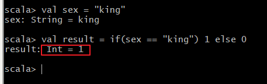

### 3-:baby:块表达式:

#### :baby_bottle:简介：

- scala中，使用{}表示一个块表达式
- 和if表达式一样，块表达式也是有值的
- 值就是最后一个表达式的值

#### :baby_bottle:举例：

**变量的值是什么**

#### :baby_bottle:代码参考：

```scala
scala> val a = {
     | println("1+1")
     | 1+1
     | }
1+1
a: Int = 2
```

#### :baby_bottle:代码截图：

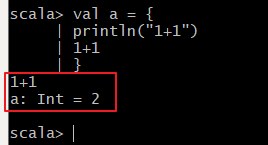

## 07-:rocket:循环

### 1-:baby:简介：

**在scala中，可以使用for和while，但一般推荐使用for表达式，因为for表达式语法更简洁**

### 2-:baby:语法格式：

```scala
for(i <- 表达式/数组/集合) {
    // 表达式
}
```

### 3-:baby:for循环表达式：

#### 1-:baby_bottle:简单循环：

##### :blonde_woman:格式：

```scala
for ( i <- 1 to 10) println(i)

1. <- 表示从 集合中取出来元素
2. i 表示 取出来的元素 每一次循环都赋值给 i
3. 如果循环体只有一个表达式 {} 可以省略
```

##### :blonde_woman:举例：

```properties
**使用for表达式打印1-10的数字**

步骤1:生成1-10的数字（提示：使用to方法）
步骤2:使用for表达式遍历，打印每个数字
```

##### :blonde_woman:参考代码一：

```scala
scala> val shu = 1.to(10)
shu: scala.collection.immutable.Range.Inclusive = Range(1, 2, 3, 4, 5, 6, 7, 8, 9, 10)

scala> for(i <- shu) println(i)
1
2
3
4
5
6
7
8
9
10

```

##### :blonde_woman:代码截图：

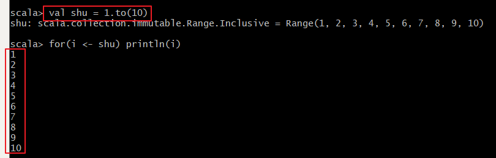

##### :blonde_woman:代码一简写:

```scala
scala> for(i <- 1 to 10 )println(i)
1
2
3
4
5
6
7
8
9
10

```

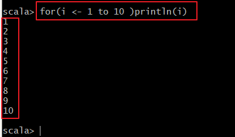

#### 2-:baby_bottle:嵌套循环：

##### :blonde_woman:格式：

```scala
for (外层循环 ; 下一层循环 ; 下一层循环) { 循环体}
```

##### :blonde_woman:举例：

**使用for表达式，打印以下字符**

```properties
*****
*****
*****

```

##### :blonde_woman:参考代码：

```scala
步骤1:
步骤2:

scala> for(i <- 1 to 3 ; j<- 1 to 5){
      print("*");
      if(j==5)
      println("")
     }
```

##### :blonde_woman:代码截图：

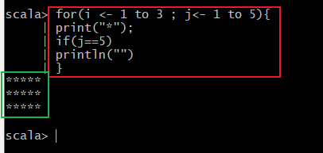

#### 3-:baby_bottle:守卫【看大门】:

##### :blonde_woman:简介:

````properties
for表达式中，可以添加if判断语句，这个if判断就称之为守卫。我们可以使用守卫让for表达式更简洁。
````

##### :blonde_woman:语法格式：

```scala
for(i <- 表达式/数组/集合 if 表达式) {
    // 表达式
}
```

##### :blonde_woman:举例：

**使用for表达式打印1-10之间能够整除3的数字**

##### :blonde_woman:参考代码：

```scala
// 添加守卫，打印能够整除3的数字
for(i <- 1 to 10 if i % 3 == 0) println(i)
```

##### :blonde_woman:代码截图：

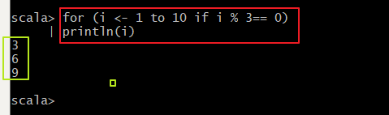

#### 4-:baby_bottle:for 推导式:

##### :blonde_woman:简介:

```properties
1.将来可以使用for推导式生成一个新的集合（一组数据）
2.在for循环体中，可以使用yield表达式构建出一个集合，我们把使用yield的for表达式称之为推导式
3.使用yield关键字会将循环体里面对每个元素的操作结果封装起来，最终返回给我们
```

##### :blonde_woman:举例：

**生成一个10、20、30...100的集合**

##### :blonde_woman:参考代码:

```scala
// for推导式：for表达式中以yield开始，该for表达式会构建出一个集合
val v = for(i <- 1 to 10) yield i * 10
```

##### :blonde_woman:代码截图：

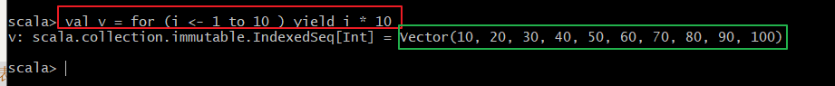

### 4-:baby:while循环:

##### :blonde_woman:简介:

```properties
scala中while循环和Java中是一致的
```

##### :blonde_woman:举例：

**打印1到10**

##### :blonde_woman:参考代码:

```scala
scala> var i = 1
i: Int = 1

scala> while (i <= 10 ){
     | println(i)
     | i= i+1
     | }
1
2
3
4
5
6
7
8
9
10
```

##### :blonde_woman:代码截图：

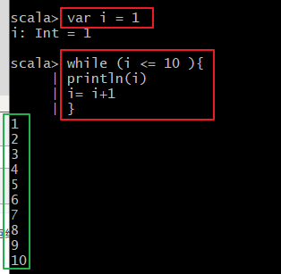

## 08-:rocket:break和continue

### 1-:baby:实现break

#### :blonde_woman:用法:

* 导入Breaks包`import scala.util.control.Breaks._`
* 使用breakable将for表达式包起来
* for表达式中需要退出循环的地方，添加`break()`方法调用

#### :blonde_woman:举例：

**使用for表达式打印1-100的数字，如果数字到达50，退出for表达式**

#### :blonde_woman:参考代码:

````scala
// 导入scala.util.control包下的Break
import scala.util.control.Breaks._

scala> breakable{
     |     for(i <- 1 to 10) {
     |         if(i >= 5) break()
     |         else println(i)
     |     }
     | }
1
2
3
4

````

#### :blonde_woman:代码截图:

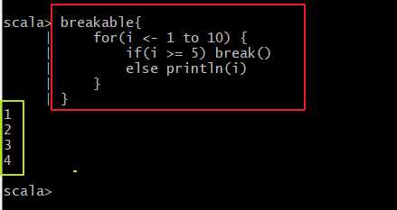

### 2-:baby:实现continue

##### :blonde_woman:用法:

```properties
continue的实现与break类似，但有不同之处：

实现break是用breakable{}将整个for表达式包起来，而实现continue是用breakable{}将for表达式的循环体包含起来就可以了

结合breakable以及break方法 实现continue，需要：
1. 用循环体 包住 breakable 体
2. 在适当的时候 使用break跳出 breakable体
3. 因为breakable体在循环体内，所以跳出breakable就还在循环内，就是执行下一次循环
```

##### :blonde_woman:举例：

**打印1-100的数字，使用for表达式来遍历，如果数字能整除10，不打印**

##### :blonde_woman:参考代码：

```scala
// 导入scala.util.control包下的Break    
import scala.util.control.Breaks._

scala> for(i <- 1 to 100 ) {
     |     breakable{
     |         if(i % 10 != 0) break()
     |         else println(i)
     |     }
     | }
10
20
30
40
50
60
70
80
90
100
```

##### :blonde_woman:代码截图：

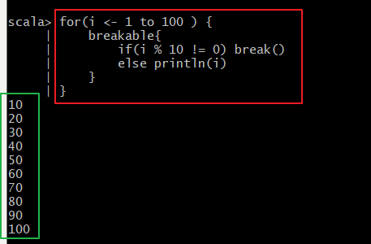

##### :blonde_woman:拓展：

**Q：为何break功能要包住外面. continue包住for循环体呢.**

```properties
答：
	1.在这两种实现中, break方法都是跳出了breakable包含的代码块,向下继续执行
	2.唯一不同的是, 如果breakable包住for循环, 那么跳出的时候, 就把for循环也跳出了, 就向下继续执行了, 就实现了类似java break的功能.
	3.如果breakable包住for循环的循环体的话, 那么跳出的时候, 还在for循环内, 只是当前这一次的循环体执行完成了, 所以继续执行就是继续执行下一次的for循环.
	4.所以, 包住的地方不同, 实现的功能不同. 但是对于breakable和break来说, 他们的功能从未改变.
```

## 09-:rocket:方法

### 0-:baby:简介:

**一个类可以有自己的方法，scala中的方法和Java方法类似。但scala与Java定义方法的语法是不一样的。**

### 1-:baby:方法定义：

#### :baby_bottle:语法格式：

```scala
def 方法名称(参数名:参数类型，参数名:参数类型):[return type] = {
方法体
}

注意:如果方法体只有一句，同样可以省略{}

调用方法用:参数名  加 参数 即可    如：add(1,2)
```

#### :baby_bottle:定义一个方法：

#### :baby_bottle:返回值类型推断：

### 2-:baby:方法参数：

#### :baby_bottle:默认参数：

#### :baby_bottle:带明参数：

#### :baby_bottle:变长参数：

### 3-:baby:方法调用方式：

#### :baby_bottle:后缀调用法:

#### :baby_bottle:中缀调用法：

#### :baby_bottle:花括号调用法：

#### :baby_bottle:无括号调用法：


## 10-:rocket:函数

## 11-:rocket:数组

## 12-:rocket:元组

## 13-:rocket:列表(List)

## 14-:rocket:集（Set）


## 15-:rocket:映射(Map)

## 16-:rocket:迭代器

## 17-:rocket:函数式编程入门

# :sunglasses:Scala Basics02

## 1-类和构造器

### 1-创建类和对象

### 定2-义访问成员变量

### 3-使用下划线初始化成员变量

### 4-定义成员方法

### 5-成员访问修饰符


## 2-构造器

### 1-主构造器


### 2-辅助构造器


## 3-单例对象

### 1-定义单例对象

### 2-使用单例对象创建工具类


### 3-单例对象中的main方法


## 4-伴生对象

### 1-定义伴生对象

### 2-apply方法与伴生对象


## 5-继承

### 1-类继承

### 2-单例对象继承

## 6-overrride 与 super

## 7-类型判断


### 1-isInstanceOf


### 2-asInstanceOf


## 8-getClass方法和classOf

## 9-抽象类

### 1-抽象类

### 2-抽象字段

## 10-匿名内部类

## 11-Trait

### 1-Trait作为接口使用

### 2-Trait中定义具体方法

### 3-使用Trait定义具体类和抽象字段

### 4-使用Trait实现模板模式

### 5-对象混入Trait

### 6-使用Trait来实现备用链模式

### 7-Trait的构造机制

### 8-Trait继承

# :sunglasses:Scala Basics03

## 1-:rocket:样例类

##### 1-定义使用样例类

##### 2-样例类方法的自动实现

## 2-:rocket:样例对象[case  && object]

## 3-:rocket:模式匹配

### 1-简单匹配

### 2-匹配类型

### 3-守卫[看大门]

### 4-匹配样例类

### 5-匹配集合

###### 1-匹配数组

###### 2-匹配List集合

###### 3-匹配元组

### 6-匹配变量声明

## 4-:rocket:Option类型

### 1-:baby:定义 +  举例

### 2-:baby:getOrElse

## 5-:rocket:偏函数

## 6-:rocket:正则表达式

### 1-:baby:匹配单个字符

### 2-:baby:匹配集合

### 3-:baby:括号匹配分组

## :rocket:7-异常处理

### 1-:baby:捕获异常

### 2-:baby:抛出异常


## 8-:rocket:提取器(Extractor   && Unapply)

## 9-:rocket:泛型(Generic Type)

### 1-:baby:定义泛型方法

### 2-:baby:定义泛型类

### 3-:baby:上下界

### 4-:baby:非变 ~协变~逆变

## 10-:rocket:Actor并发编程 

### 1-:baby:Actor简介

### 2-:baby:Actor创建

### 3-:baby:Actor发送和接受消息

#### 1-:baby_bottle:Actor之间互发消息

#### 2-:baby_bottle:非Actor向Actor发送消息后接收返回

### 4-:baby:持续发送和接受消息

#### 1-:baby_bottle:while true

#### 2-:baby_bottle:loop ~react 优化

### 5-:baby:发送接受自定义消息(样例类)


## 11-:rocket:WordCount 综合案例

#### 1-:baby:[步骤一] : 获取文件列表

#### 2-:baby:[步骤二] : 创建WordCountActor

#### 3-:baby:[步骤三] : 启动Actor~发送~接收任务消息

#### 4-:baby:[步骤四] : 消息统计文件单词计数

#### 5-:baby:[步骤五] : 分装单词计数结果回复给MainActor

#### 6-:baby:[步骤六] : 合并结果


# :sunglasses:Scala Basics04

## 1-:rocket:高阶函数

### 1-:baby:作为值的函数

### 2-:baby:匿名函数

### 3-:baby:柯里化

### 4-:baby:闭包

## 2-:rocket:隐式转换和隐式参数

### 1-:baby:使用隐式转换

### 2-:baby:自动导入隐式转换

### 3-:baby:隐式参数

## 3-:rocket:Akka并发编程

### 1-:baby:Akka简介

### 2-:baby:入门案例

### 3-:baby:Akka定时任务

### 4-:baby:实现进程间通信~Master实现

### 5-:baby:简易Spark通信框架举例